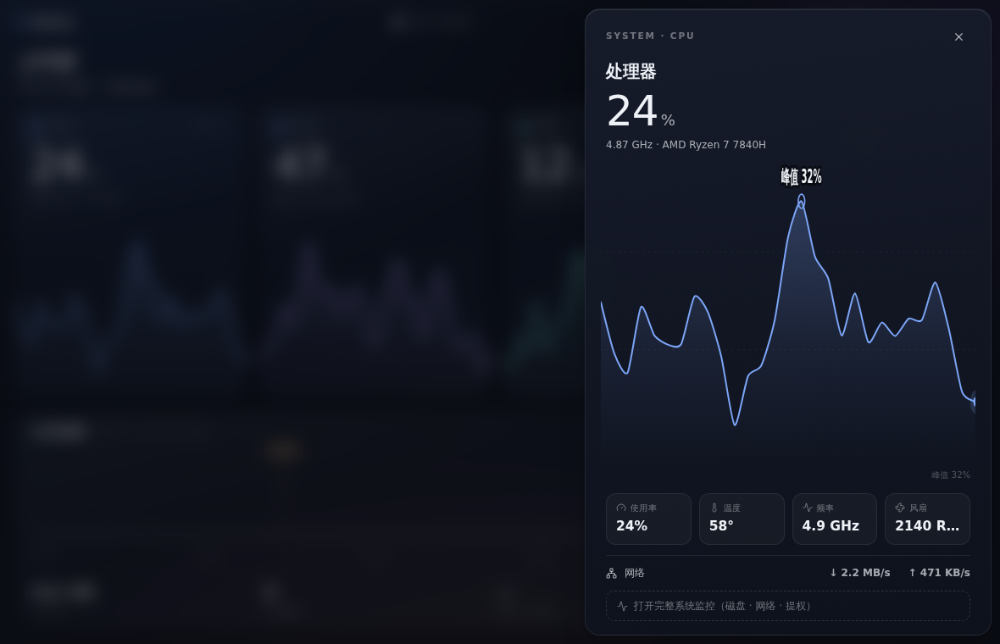
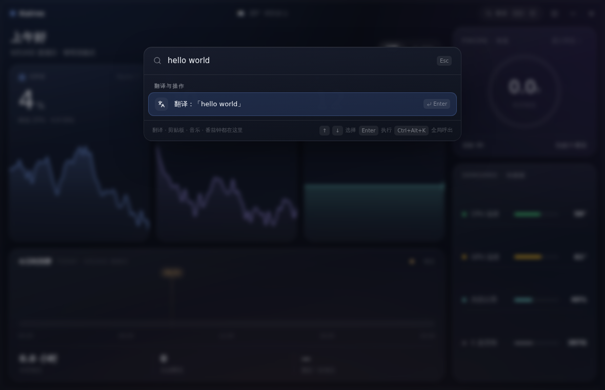
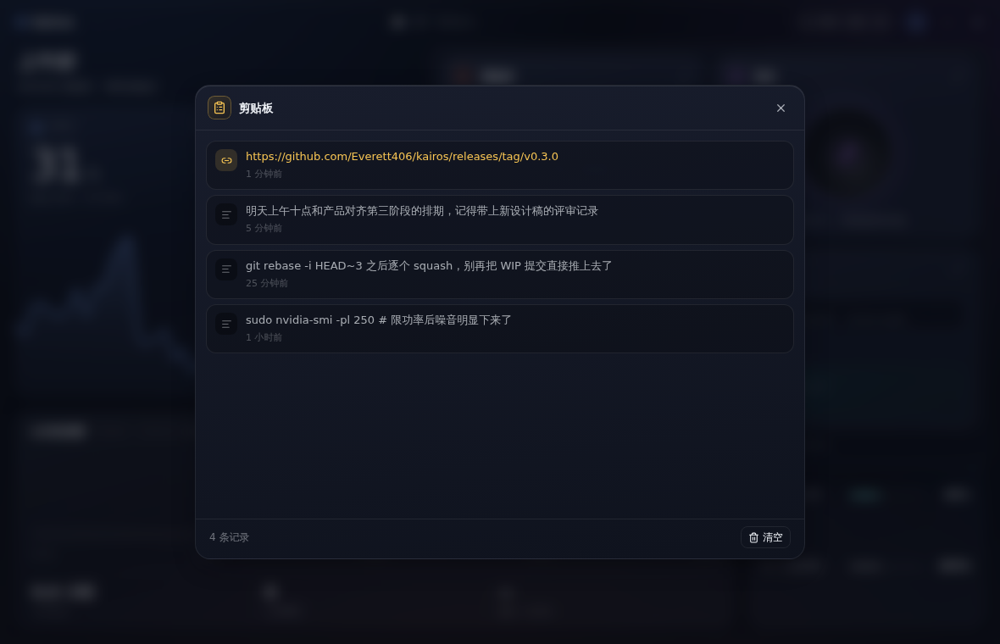

<div align="center">

# Kairos

**常驻 Windows 桌面的磨砂质感系统仪表**

*Kairos（καιρός），希腊语里「恰逢其时的那一刻」。

一块 acrylic 磨砂玻璃卧在桌面上：三大指标卡带真实传感器曲线，今日时间带点亮你的专注轨迹，
翻译 / 剪贴板 / 音乐 / 番茄钟收进标题栏九宫格，任何应用下 Ctrl+Alt+K 呼出全局命令条。
不注册、不上云，数据都留在你自己的电脑里。

[](https://github.com/Everett406/kairos/releases)


[下载安装](#安装) · [功能总览](#功能总览) · [常见问题](#常见问题-faq) · [参与开发](#开发)

<br>


</div>

## 为什么是 Kairos

- **六合一，一眼即得** —— 天气 / 系统监控 / 番茄钟 / 音乐 / 剪贴板 / 翻译全部收纳进一块仪表盘：高频信息在主画布，低频功能进九宫格，全局命令条打字直达。
- **磨砂有深度** —— Windows acrylic 材质实时模糊你的桌面壁纸，壁纸只在玻璃深处隐约透出；浏览器般的安静，不抢内容。
- **真·硬件监控** —— CPU / GPU / 内存三大指标卡带实时曲线（毛刺与尖峰如实呈现），点开抽屉看网格大图与四格读数；管理员模式下经 LibreHardwareMonitor 读取温度、风扇与磁盘忙碌度。
- **全局呼出** —— 任何应用下 Ctrl+Alt+K 呼出命令条：输入即翻译、一键开始专注、复制剪贴板、控制音乐。
- **数据不出本机** —— 没有账号体系，偏好、历史与凭据全部只存在本地。

## 功能总览

| 模块 | 入口 | 能做什么 |
| --- | --- | --- |
| ☁️ 天气 | 标题栏天气 chip → 弹窗 | Open-Meteo 预报（当前 / 24h 降水 / 15 日）、中国 AQI（HJ 633-2012）、城市搜索与 IP 自动定位、日出日落、穿衣建议、降雨 / 紫外线 / 降温预警通知，30 分钟自动刷新 |
| 🖥️ 系统 | 主画布三卡 → 抽屉 / 监控弹窗 | CPU / GPU / 内存实时曲线（2s 轮询）、今日时间带、传感器读数；抽屉内网格大图 + 四格读数 + 网速；管理员模式经 LibreHardwareMonitor（WMI 桥）读取温度、风扇、内存规格 |
| 🍅 番茄钟 | 九宫格 / 专注场景 | 专注 / 短休 / 长休三模式、时长自定义、完成通知；专注会话如实落在今日时间带，专注场景全屏极简计时 |
| 🎵 音乐 | 九宫格 / 命令条 | QQ 音乐搜索、播放（免费 128k，贴 cookie 登录后可播 VIP）、同步歌词高亮（QQ LRC → LRCLIB 两级来源）、专注场景显示当前曲目 |
| 📋 剪贴板 | 九宫格 / 命令条 | 后台监听历史（去重置顶、上限 100 条）、点击回填复制、单条删除与清空，最近条目直达命令条 |
| 🌐 翻译 | 命令条 / 九宫格 | Google 免费端点、8 种目标语言、防抖自动翻译；命令条输入即译，一键复制结果 |

## 界面一览

| 主画布 · 磨砂仪表 | 指标抽屉 · 大曲线 | 全局命令条 · Ctrl+Alt+K |
| --- | --- | --- |
|  |  |  |

| 天气 · 弹窗 | 系统监控 · 弹窗 | 番茄钟 |
| --- | --- | --- |
|  |  |  |

| 音乐 | 剪贴板 | 翻译 |
| --- | --- | --- |
|  |  |  |

## 安装

到 [Releases](https://github.com/Everett406/kairos/releases) 下载对应产物：

| 产物 | 适合谁 | 用法 |
| --- | --- | --- |
| `Kairos_x.y.z_x64-setup.exe` | 大多数用户 | 双击安装，开始菜单启动 |
| `Kairos_x.y.z_x64-portable.zip` | 免安装党 | 解压即用；保持 `Kairos.exe` 与 `resources/` 目录同层 |

> 首次运行若遇 SmartScreen 提示：安装包未做代码签名，点「更多信息 → 仍要运行」即可。

## 使用与权限

- **默认运行**：天气 / 音乐 / 剪贴板 / 翻译 / 番茄钟全部可用；系统指标显示占用但无温度。
- **管理员模式**：监控弹窗内一键 UAC 提权重启，解锁温度 / 风扇 / 磁盘忙碌度（安装包随附 LibreHardwareMonitor，首次提权自动拉起）。
- **全局热键**：任何应用下 **Ctrl+Alt+K** 呼出命令条（应用内 Ctrl+K 同效）；↑↓ 选择、Enter 执行、Esc 关闭。
- **音乐 VIP**：展开音乐弹窗 → 登录 → 粘贴 y.qq.com 完整 cookie（含 `uin` 与 `qm_keyst`）。凭据仅保存在本机应用数据目录。

## 常见问题 FAQ

**Q：系统监控里看不到温度 / 风扇转速？**
Windows 把传感器接口锁在管理员权限后面。打开监控弹窗点「启用」，走一次 UAC 提权重启即可解锁温度、风扇与磁盘忙碌度。

**Q：安装时被 SmartScreen 拦截？**
安装包目前未做代码签名，属于正常现象：点「更多信息 → 仍要运行」。

**Q：VIP 歌曲放不了？**
免费曲目（128k）无需登录可直接播放；VIP 曲目需要你粘贴自己 y.qq.com 的完整 cookie，凭据只存在本机应用数据目录，不会上传。

**Q：便携版和安装版有什么区别？**
功能完全一致。便携版解压即用、不写注册表，唯一要注意的是别把 `Kairos.exe` 和 `resources/` 目录拆开。

**Q：磨砂效果在旧系统上失效？**
acrylic 材质需要 Windows 10 1809+（WebView2 常青版）。不满足时窗口自动退回深色实底，功能不受影响。

## 开发

```bash
pnpm install
pnpm tauri dev      # 开发调试
pnpm tauri build    # 本地出包
pnpm build          # 仅构建前端（Vite 产物）
```

环境要求：Node 22+、pnpm 10、Rust stable、Windows 10 1809+（WebView2 常青版）。

| 层 | 技术 |
| --- | --- |
| 桌面壳 | Tauri 2（Rust），无边框窗口 + 自绘标题栏 + acrylic 磨砂 + 全局热键 |
| 前端 | React 19 + TypeScript + Vite 7 |
| 动效 | CSS 过渡体系（150–280ms 克制微动：数字滚动 / 抽屉弹簧滑入 / 弹窗缩放淡入） |
| 图表 | 自绘 SVG（轻平滑 Catmull-Rom + 面积渐变 + 峰值标注，`src/lib/charts.tsx`） |
| 图标 | lucide-react + Meteocons（天气） |
| 系统信息 | sysinfo + WMI + LibreHardwareMonitor（Rust 侧） |

前端与 Rust 之间只通过 **16 个显式命令**与 **1 个事件**（`clipboard-changed`）+ 全局热键事件（`global-cmd`）通信，全部经由 `src/lib/bridge.ts` 单点收发；`bridge.ts` 内置浏览器 mock 层，UI 可以脱离桌面壳独立渲染（`bun run dev` / `pnpm dev` 直接浏览器打开）。设计 token、模块约定、已知坑等完整交接细节见 [HANDOFF.md](HANDOFF.md)。

## 发布

推送 `v*` tag（如 `git tag v0.3.1 && git push origin v0.3.1`），GitHub Actions 自动完成构建，约 12 分钟后产出 NSIS 安装包与便携版 zip，并以 **Draft Release** 形式挂出；人工验收无误后手动转正式。

## Roadmap

- [ ] 呼吸边条：屏幕右缘独立置顶小窗（触边滑出 / 可钉住）
- [ ] 亮色主题「晨雾」（v4 视觉稿已定稿，补齐 shell 语义映射即可）
- [ ] 设置页：热键自定义 / 开机自启 / 刷新频率 / 磨砂浓度
- [ ] 主画布布局自定义：指标卡排序、隐藏模块
- [ ] 音乐：播放队列持久化、桌面歌词
- [ ] 天气：预警通知细分开关

## 许可

个人项目，仅供学习交流。
