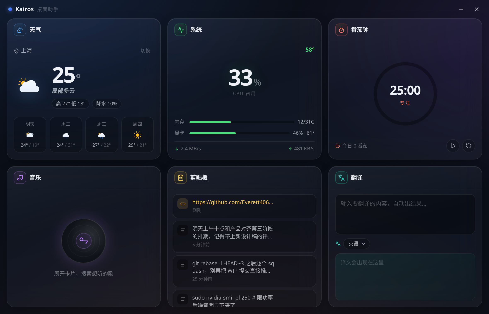
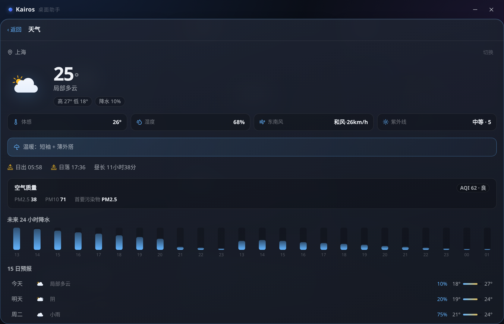
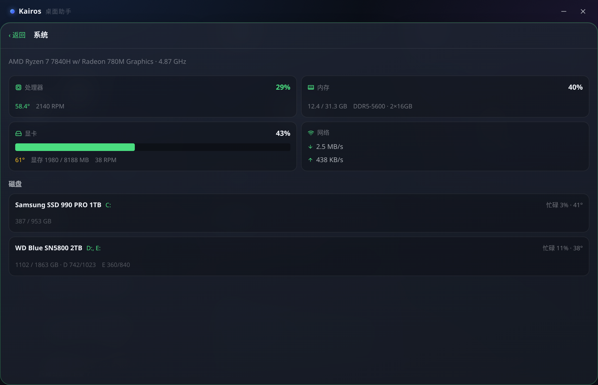
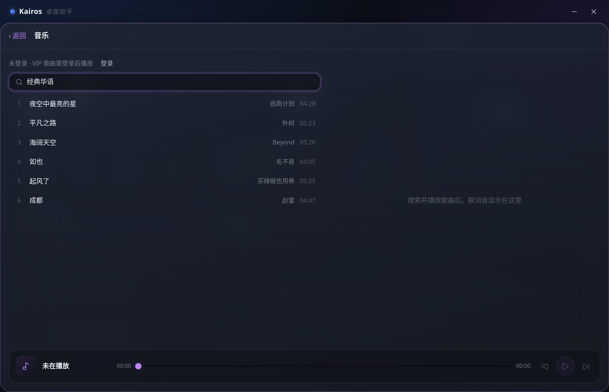
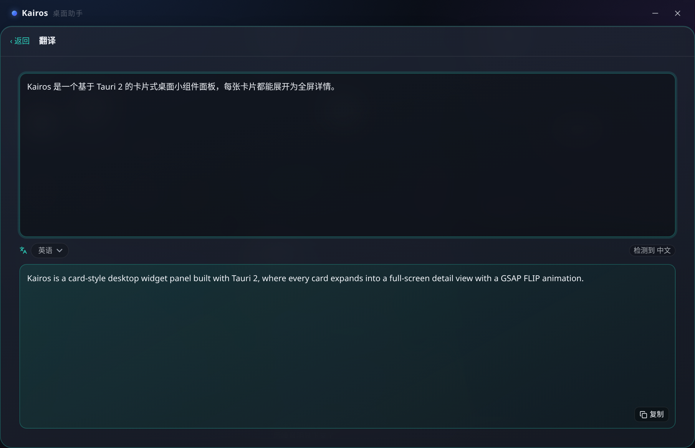

<div align="center">

# Kairos

**常驻 Windows 桌面的卡片式小组件面板**

Tauri 2 · React 19 · TypeScript · 7.5 MB 安装包

[](https://github.com/Everett406/kairos/releases)
[](https://github.com/Everett406/kairos/actions/workflows/release.yml)

</div>

---

六张卡片以网格排布在一张无边框毛玻璃面板上，点开任意卡片即以 GSAP FLIP 动画展开为全屏详情。整套界面建立在两级设计 token（primitive → semantic）之上，每张卡片注入独立的模块主题色，换肤只需替换一份语义映射文件。

## 界面一览

| 主面板 | 天气 · 展开态 | 系统监控 · 展开态 |
| --- | --- | --- |
|  |  |  |

| 番茄钟 | 音乐 | 翻译 |
| --- | --- | --- |
|  |  |  |

## 功能

| 模块 | 功能 | 主题色 |
| --- | --- | --- |
| ☁️ 天气 | Open-Meteo 预报（当前 / 24h 降水 / 15 日）、中国 AQI（HJ 633-2012）、城市搜索与 IP 自动定位、日出日落、穿衣建议、降雨 / 紫外线 / 降温预警通知，30 分钟自动刷新 | 天蓝 |
| 🖥️ 系统 | CPU / 内存 / GPU / 网速实时监控（2s 轮询）、磁盘分组容量与忙碌度；管理员模式经 LibreHardwareMonitor（WMI 桥）读取温度、风扇、内存规格 | 翠绿 |
| 🍅 番茄钟 | 专注 / 短休 / 长休三模式、时长自定义、环形进度、完成通知、每日统计（数据存本地） | 珊瑚 |
| 🎵 音乐 | QQ 音乐搜索、播放（免费 128k，贴 cookie 登录后可播 VIP）、同步歌词高亮（QQ LRC → LRCLIB 两级来源）、全局播放条（面板切换不断播） | 绛紫 |
| 📋 剪贴板 | 后台监听历史（去重置顶、上限 100 条）、点击回填复制、单条删除与清空 | 琥珀 |
| 🌐 翻译 | Google 免费端点、8 种目标语言、防抖自动翻译、检测语言与目标一致时自动反向 | 青碧 |

## 权限说明

- **默认运行**：天气 / 音乐 / 剪贴板 / 翻译 / 番茄钟全部可用；系统模块显示占用但无温度。
- **管理员模式**：系统卡片内一键 UAC 提权重启，解锁温度 / 风扇 / 磁盘忙碌度（安装包随附 LibreHardwareMonitor，首次提权自动拉起）。
- **音乐 VIP**：展开音乐卡片 → 登录 → 粘贴 y.qq.com 完整 cookie（含 `uin` 与 `qm_keyst`）。凭据仅保存在本机应用数据目录。

## 安装与使用

到 [Releases](https://github.com/Everett406/kairos/releases) 下载 Draft 或正式发布：

- `Kairos_x.y.z_x64-setup.exe` — NSIS 安装包，双击安装
- `Kairos_x.y.z_x64-portable.zip` — 便携版，解压即用、免安装，`Kairos.exe` 需与 `resources/` 目录保持在同一层

> 系统模块的温度 / 风扇 / 磁盘详情需要管理员权限：在系统卡片内点「启用」走 UAC 即可。

## 开发

```bash
pnpm install
pnpm tauri dev      # 开发调试
pnpm tauri build    # 本地出包
pnpm build          # 仅构建前端（Vite 产物）
```

要求：Node 22+、pnpm 10、Rust stable、Windows 10 1809+（WebView2 常青版）。

### 技术栈

| 层 | 技术 |
| --- | --- |
| 桌面壳 | Tauri 2（Rust），无边框窗口 + 自绘标题栏 |
| 前端 | React 19 + TypeScript + Vite 7 |
| 动效 | GSAP FLIP（卡片展开 / 收起） |
| 图标 | lucide-react + Meteocons（天气） |
| 系统信息 | sysinfo + WMI + LibreHardwareMonitor（Rust 侧） |

### 架构

```
src/
  design/     设计 token：tokens.css(primitive) → theme-*.css(semantic) → primitives.tsx(组件)
  app/        外壳：标题栏、模块卡片（FLIP 展开收起、data-mod 模块主题色注入）
  features/   六个功能模块，各自独立目录（model / api / hook / Panel / css）
  lib/        bridge.ts(IPC 唯一入口)、mock.ts(浏览器 mock 层，仅非 Tauri 环境生效)、format.ts
src-tauri/
  commands/   weather / system / music / clipboard / translate
  store.rs    JSON 持久化（原子写）
```

前端与 Rust 之间只通过 **16 个显式命令**与 **1 个事件**（`clipboard-changed`）通信，全部经由 `src/lib/bridge.ts` 单点收发。

浏览器 mock 层：`bridge.ts` 检测到非 Tauri 环境（如浏览器预览、截图流水线）时自动切换到 `mock.ts` 假数据，使 UI 可以脱离桌面壳独立渲染。

## 发布

推送 `v*` tag（如 `git tag v0.3.1 && git push origin v0.3.1`），GitHub Actions 自动：

1. 下载 LibreHardwareMonitor 随包分发（不入 git）
2. 构建 NSIS 安装包 + 便携版 zip
3. 创建 **Draft Release** 并上传两个产物

发布一律先出草稿，人工审核确认无误后再手动转正式。

## 许可

个人项目，仅供学习交流。
